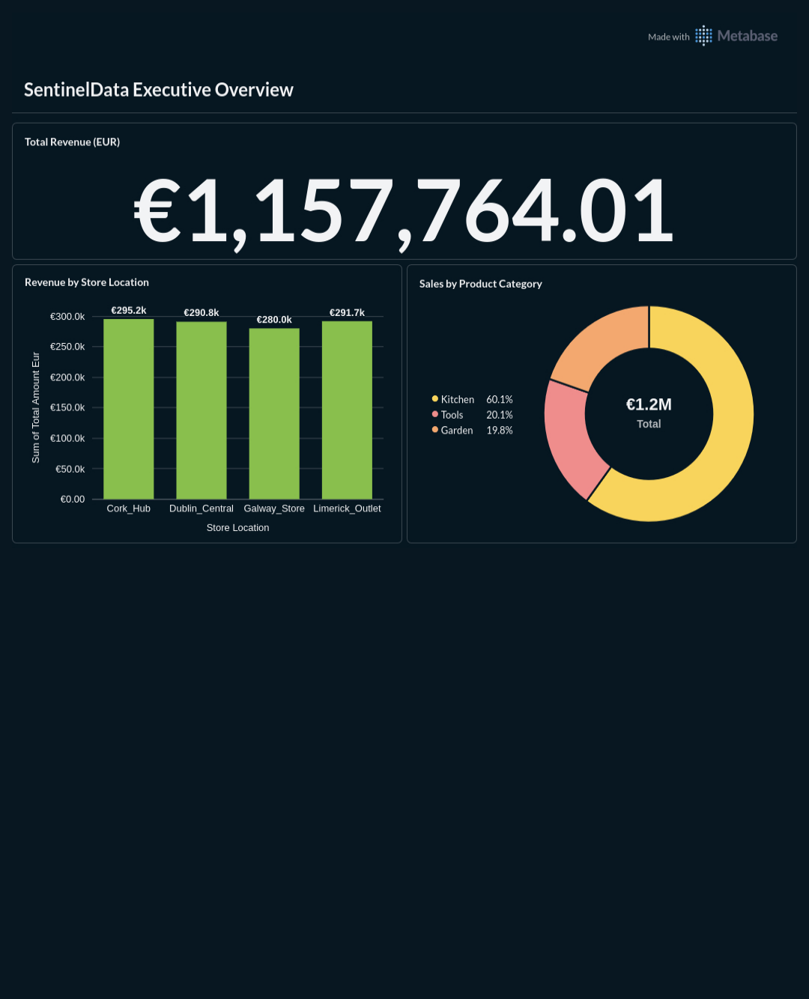

# SentinelData: Scalable Enterprise ETL & Transactional Pipeline


## 📌 Project Overview

**SentinelData** is a high-performance data engineering pipeline designed to simulate a global retail ERP environment. The project demonstrates the end-to-end lifecycle of financial transaction data—from raw, unstructured ingestion to structured, BI-ready data warehousing.

This project was built to showcase advanced concepts in **Data Integrity**, **ETL Orchestration**, and **Relational Modeling**, mirroring the architectural challenges found in large-scale distribution and billing systems.

---

## 📊 Analytics Dashboard


_Real-time analytics generated via Metabase showing revenue trends and store performance._

---

## 🏗️ System Architecture

The pipeline is divided into three decoupled layers to ensure scalability and ease of maintenance:

### 1. Data Generation Layer (Java)

- **Role:** Acts as the Transactional System (OLTP).
- **Function:** Generates thousands of mock invoice records simulating daily retail operations.
- **Features:** Supports multi-currency pricing, international SKU formats, and randomized store location data.

### 2. Transformation Layer (Python / Pandas)

- **Role:** The ETL Engine.
- **Function:** Ingests raw files, cleans "dirty" records, and applies business logic.
- **Features:** Dynamic tax calculation logic, currency normalization, and schema validation before database insertion.

### 3. Analytics Layer (PostgreSQL)

- **Role:** The Data Warehouse (OLAP).
- **Function:** Stores processed data in a **Star Schema** optimized for Business Intelligence.
- **Features:** Fact tables for sales transactions and Dimension tables for Products, Dates, and Stores.

---

## 🚀 Key Technical Features

- **Dockerized Infrastructure:** Fully orchestrated via `docker-compose` for one-click deployment on a VPS or local machine.
- **Star Schema Design:** Purpose-built for high-performance analytical queries and seamless integration with PowerBI/Tableau.
- **Enterprise Logic:** Includes complex billing logic (tax rules, discounts, and currency conversion) based on real-world ERP requirements.

---

## 🛠️ Tech Stack

- **Languages:** Java 21, Python 3.11, SQL
- **Data Tools:** Pandas (Transformation)
- **Database:** PostgreSQL 16
- **DevOps:** Docker, Docker Compose, Bash

---

## 🚦 Installation & Execution

1. **Clone the repository:**
   ```bash
   git clone [https://github.com/tiagoertel/sentinel-data-pipeline.git](https://github.com/tiagoertel/sentinel-data-pipeline.git)
   cd sentinel-data-pipeline
   ```
2. **Environment Setup:** Ensure you have Docker and Python installed.
3. **Launch Infrastructure:**
   ```bash
   chmod +x run_pipeline.sh
   ./run_pipeline.sh
   ```
